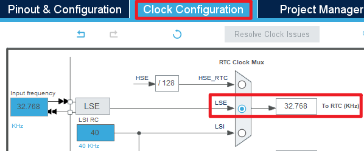
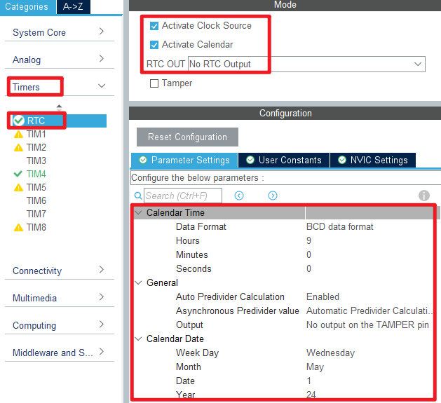
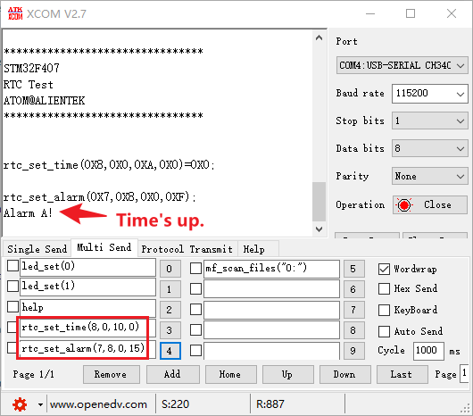

## RTC example<a name="brief"></a>

### 1 Brief
The function of this code is to generate an RTC wake-up interrupt every second.
### 2 Hardware Hookup
The hardware resources used in this example are:
+ LED0 - PE5
+ LED1 - PE6
+ USART1 - PA9/PA10
+ RTC
+ ALIENTEK  2.8/3.5/4.3/7 inch TFTLCD module

The RTC used in this example is the on-chip resource of STM32F407, so there is no corresponding connection schematic.

### 3 STM32CubeIDE Configuration


Let's copy the project from  **12_usmart** and name both the project and the.ioc file **13_rtc**. Next we start the RTC configuration by double-clicking the **13_rtc.ioc** file.

First click **Clock Configuration** and set it as shown below.



Open **Timers > RTC** as shown below.



Open **NVIC** configuration as shown below.


Click **File > Save**, and you will be asked to generate code.Click **Yes**.

##### code
###### rtc.c
We added a lot of code to rtc.c, so you can open the source code to have a look, but here are the important ones:
```c#
uint8_t rtc_set_time(uint8_t hour, uint8_t minute, uint8_t second, uint8_t ampm)
{
    RTC_TimeTypeDef sTime = {0};

    sTime.Hours = hour;
    sTime.Minutes = minute;
    sTime.Seconds = second;
    sTime.TimeFormat = ampm;
    sTime.DayLightSaving = RTC_DAYLIGHTSAVING_NONE;
    sTime.StoreOperation = RTC_STOREOPERATION_RESET;
    if (HAL_RTC_SetTime(&hrtc, &sTime, RTC_FORMAT_BIN) != HAL_OK)
    {
        return 1;
    }

    return 0;
}
```
The preceding function is used to set a time.We input a time that will be used as a baseline for subsequent calculations.

```c#
void rtc_get_time(uint8_t *hour, uint8_t *minute, uint8_t *second, uint8_t *ampm)
{
    RTC_TimeTypeDef sTime = {0};

    HAL_RTC_GetTime(&hrtc, &sTime, RTC_FORMAT_BIN);

    *hour = sTime.Hours;
    *minute = sTime.Minutes;
    *second = sTime.Seconds;
    *ampm = sTime.TimeFormat;
}
```
The above function will help us get the time, hour, second, and so on.

###### main.c
Add some codes between the /* USER CODE */ guards as follow:
```c#
int main(void)
{
  /* USER CODE BEGIN 1 */
  uint8_t t = 0;
  char tbuf[40];
  uint8_t hour, minute, second, ampm;
  uint8_t year, month, date, week;
  /* USER CODE END 1 */

  /* MCU Configuration--------------------------------------------------------*/

  /* Reset of all peripherals, Initializes the Flash interface and the Systick. */
  HAL_Init();

  /* USER CODE BEGIN Init */

  /* USER CODE END Init */

  /* Configure the system clock */
  SystemClock_Config();

  /* USER CODE BEGIN SysInit */

  /* USER CODE END SysInit */

  /* Initialize all configured peripherals */
  MX_GPIO_Init();
  MX_USART1_UART_Init();
  MX_FSMC_Init();
  MX_TIM4_Init();
  MX_RTC_Init();
  /* USER CODE BEGIN 2 */
  lcd_init();                                  /* Initialize LCD */
  stm32f407vg_show_mesg();
  lcd_show_string(30, 50, 200, 16, 16, "STM32", RED);
  lcd_show_string(30, 70, 200, 16, 16, "RTC TEST", RED);
  lcd_show_string(30, 90, 200, 16, 16, "ATOM@ALIENTEK", RED);

  /* Set RTC periodic wake-up interrupt */
  rtc_set_wakeup(RTC_WAKEUPCLOCK_CK_SPRE_16BITS, 0);
  /* USER CODE END 2 */

  /* Infinite loop */
  /* USER CODE BEGIN WHILE */
  while (1)
  {
    t++;

    if ((t % 10) == 0)
    {
        /* Get the RTC time information */
        rtc_get_time(&hour, &minute, &second, &ampm);
        sprintf(tbuf, "Time:%02d:%02d:%02d", hour, minute, second);
        lcd_show_string(30, 120, 210, 16, 16, tbuf, RED);
        /* Get the RTC date information */
        rtc_get_date(&year, &month, &date, &week);
        sprintf(tbuf, "Date:20%02d-%02d-%02d", year, month, date);
        lcd_show_string(30, 140, 210, 16, 16, tbuf, RED);
        sprintf(tbuf, "Week:%d", week);
        lcd_show_string(30, 160, 210, 16, 16, tbuf, RED);
    }

    if (t == 20)
    {
        t = 0;
        LED0_TOGGLE();   /* LED0 blinks to indicate that the program is running */
    }

    HAL_Delay(10);       /* delay 10ms */
    /* USER CODE END WHILE */

    /* USER CODE BEGIN 3 */
  }
  /* USER CODE END 3 */
}
```

###### usmart_port.c
In order to facilitate the call verification of RTC-related functions, **usmart_nametab** is modified in this file as follows:
```c#
struct _m_usmart_nametab usmart_nametab[] =
{
#if USMART_USE_WRFUNS == 1      /* If read and write operations are enabled */
    {(void *)read_addr, "uint32_t read_addr(uint32_t addr)"},
    {(void *)write_addr, "void write_addr(uint32_t addr,uint32_t val)"},
#endif
	{(void *)rtc_set_time, "uint8_t rtc_set_time(uint8_t hour, uint8_t minute, uint8_t second, uint8_t ampm)"},
	{(void *)rtc_set_alarm, "void rtc_set_alarm(uint8_t week, uint8_t hour, uint8_t minute, uint8_t second)"},
};
```
The related functions of RTC are added to USMART, so that RTC time and alarm clock can be set directly through the serial port.


### 4 Running

#### 4.1 Compile & Download

After the compilation is complete, connect the DAP and the Mini Board, and then connect to the computer together to download the program to the Mini Board.

#### 4.2 Phenomenon

Press the **RESET** button to begin running the program on your Mini Board, observe the LED0 flashing on the Mini Board, open the serial port and the host computer **ATK-XCOM** can see the prompt information of the example, indicating that the code download is successful. We use the serial port to debug the RTC phenomenon as shown below:



[jump to title](#brief)