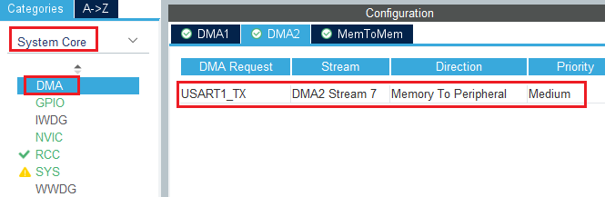
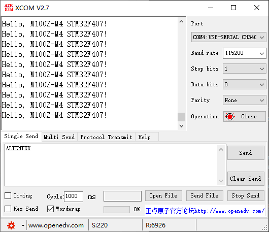

## DMA example<a name="brief"></a>

### 1 Brief
The function of this code is to press the KEY0 button, serial port USART1 to send data in DMA mode.
### 2 Hardware Hookup
The hardware resources used in this example are:
+ LED0 - PE5
+ LED1 - PE6
+ USART1 - PA9/PA10
+ DMA2 - Stream7(Channel4) 
+ KEY - KEY0(PA15) 
+ ALIENTEK  2.8/3.5/4.3/7 inch TFTLCD module

The DMA used in this example is an on-chip resource of STM32F407, so there is no corresponding connection schematic.

### 3 STM32CubeIDE Configuration

We copy the **11_tftlcd** project and name both the project and the.ioc file **16_dma**.Next we start the DMA configuration by double-clicking the **16_dma.ioc** file.

Open **System Core > DMA > DMA2** as shown below.



Click **File > Save**, and you will be asked to generate code.Click **Yes**.

##### code
###### main.c
In the main function, we have added some additional code, which is as follows.
```c#
/* USER CODE BEGIN PD */
uint8_t temp[] = {"Hello, M100Z-M4 STM32F407!\r\n"};

#define SEND_BUF_SIZE     (sizeof(temp) * 200)

uint8_t g_sendbuf[SEND_BUF_SIZE];

uint8_t uart_ready = 1;
extern DMA_HandleTypeDef hdma_usart1_tx;
/* USER CODE END PD */

int main(void)
{
  /* USER CODE BEGIN 1 */
  uint8_t t = 0;
  uint8_t key;
  uint16_t len;
  uint16_t buf_index;
  uint8_t temp_index;
  float pro = 0;          /* rate of progress */
  /* USER CODE END 1 */

  /* MCU Configuration--------------------------------------------------------*/

  /* Reset of all peripherals, Initializes the Flash interface and the Systick. */
  HAL_Init();

  /* USER CODE BEGIN Init */

  /* USER CODE END Init */

  /* Configure the system clock */
  SystemClock_Config();

  /* USER CODE BEGIN SysInit */

  /* USER CODE END SysInit */

  /* Initialize all configured peripherals */
  MX_GPIO_Init();
  MX_DMA_Init();
  MX_USART1_UART_Init();
  MX_FSMC_Init();
  /* USER CODE BEGIN 2 */

  lcd_init();                                         /* Initialize LCD */
  stm32f407vg_show_mesg();
  lcd_show_string(30, 50, 200, 16, 16, "STM32", RED);
  lcd_show_string(30, 70, 200, 16, 16, "DMA TEST", RED);
  lcd_show_string(30, 90, 200, 16, 16, "ATOM@ALIENTEK", RED);
  lcd_show_string(30, 110, 200, 16, 16, "KEY0:Start", RED);

  /* Preparing the data */
  for (buf_index=0; buf_index<200; buf_index++)
  {
     for (temp_index=0; temp_index<sizeof(temp); temp_index++)
     {
    	 g_sendbuf[buf_index*sizeof(temp) + temp_index] = temp[temp_index];
     }
  }
  /* USER CODE END 2 */

  /* Infinite loop */
  /* USER CODE BEGIN WHILE */
  while (1)
  {
    key = key_scan(0);

	  if (key == KEY0_PRES)       /* press KEY0 */
	  {
	  	  printf("\r\nDMA DATA:\r\n");
	  	  lcd_show_string(30, 130, 200, 16, 16, "Start Transimit....", BLUE);
	  	  lcd_show_string(30, 150, 200, 16, 16, "   %", BLUE);    /* Display percent sign */

	  	  HAL_UART_Transmit_DMA(&huart1, g_sendbuf, SEND_BUF_SIZE);

	  	  while (1)
	  	  {
	  		  if (uart_ready == 1)
	  		  {
	  		     uart_ready = 0;
	  		     break;
	  		  }

	  		  pro = __HAL_DMA_GET_COUNTER(&hdma_usart1_tx);
	  		  len = SEND_BUF_SIZE;        /* total length */
	  		  pro = 1 - (pro / len);      /* get the percentage */
	  		  pro *= 100;                 /* 100 times larger */
	  		  lcd_show_num(30, 150, pro, 3, 16, BLUE);
	  	  }
	  	  lcd_show_num(30, 150, 100, 3, 16, BLUE);    /* Display 100% */
	  	  lcd_show_string(30, 130, 200, 16, 16, "Transimit Finished!", BLUE); /* Prompt transmission completed */
	 }

	 t++;
	 HAL_Delay(10);

	 if (t == 20)
	 {
	    LED0_TOGGLE();  /* flashing LED0 indicates that the system is running */
	    t = 0;
	 }
    /* USER CODE END WHILE */

    /* USER CODE BEGIN 3 */
  }
  /* USER CODE END 3 */
}
```

### 4 Running
#### 4.1 Compile & Download
After the compilation is complete, connect the DAP and the Mini Board, and then connect to the computer together to download the program to the Mini Board.
#### 4.2 Phenomenon
Press the **RESET** button to begin running the program on your Mini Board, observe the LED0 flashing on the Mini Board, open the serial port and the host computer **ATK-XCOM** can see the prompt information of the example, indicating that the code download is successful. After pressing the KEY0 button, you can see the data sent by the Mini Board in the serial port debugging assistant, and the transmission will be prompted after the completion of transmission, as shown in the following figure:



[jump to title](#brief)