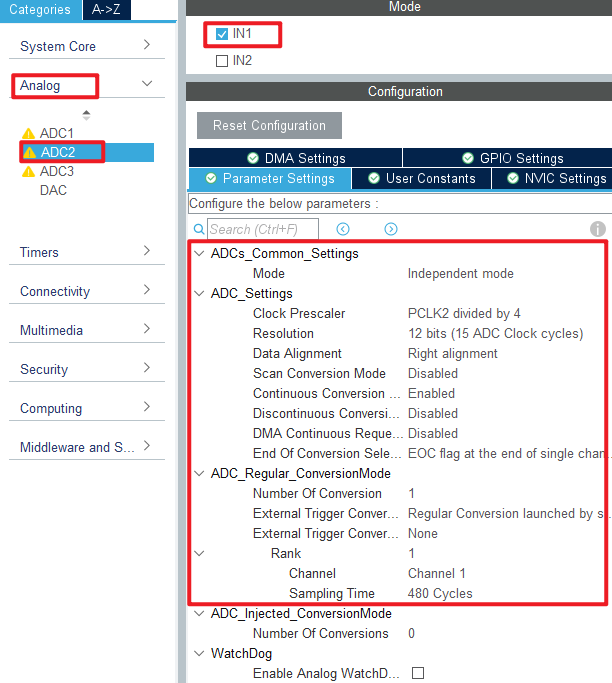
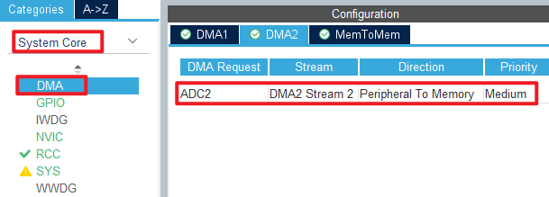
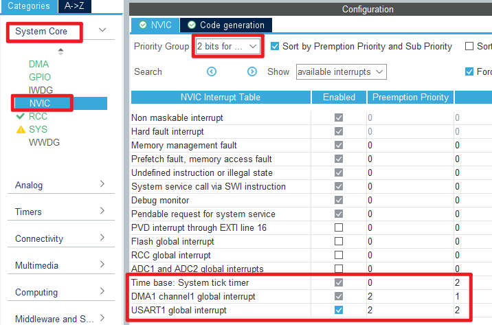
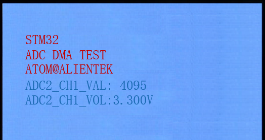

## ADC_DMA_Single_Channel example<a name="brief"></a>

### 1 Brief
The function of this code is to collect the voltage on the ADC channel 1 through DMA, and display the digital amount of the voltage converted by the ADC and the analog amount converted on the LCD module screen.
### 2 Hardware Hookup
The hardware resources used in this example are:
+ LED0 - PE5
+ USART1 - PA9/PA10
+ ADC2 - Channel1(PA1)
+ DMA2 - Stream2
+ ALIENTEK  2.8/3.5/4.3/7 inch TFTLCD module

The ADC used in this example is an on-chip resource of STM32F407, so there is no corresponding connection schematic.

### 3 STM32CubeIDE Configuration

We copy the previous chapter project and name both the project and the.ioc file **17_2_adc_dma_single_channel**.Next we start the ADC configuration by double-clicking the **17_2_adc_dma_single_channel.ioc** file.

Since our implementation is based on the previous project, the ADC pin does not need to be configured again, and we mainly modify the ADC parameters and configure the DMA.

Click **Analog > ADC1** to set.



In this example, DMA is used to transfer data, and the configuration is shown in the following figure.



Then configure the interrupt priority for DMA.



Click **File > Save**, and you will be asked to generate code.Click **Yes**.

##### code
We add some code to the adc.c file.

```c#
void adc_dma_enable(uint16_t cndtr)
{
    ADC2->CR2 &= ~(1 << 0);                /* Turn off the ADC first */

    DMA2_Stream2->CR &= ~(1 << 0);         /* Turn off DMA transfers */
    while (DMA2_Stream2->CR & (1 << 0));   /* Make sure DMA can be set */
    DMA2_Stream2->NDTR = cndtr;            /* Amount of data transferred by DMA */
    DMA2_Stream2->CR |= 1 << 0;            /* Enable DMA transfer */

    ADC2->CR2 |= 1 << 0;                   /* Restart the ADC */
    ADC2->CR2 |= 1 << 22;                  /* Start the rule transition channel */
}

/**
 * @brief   Gets the ADC converted result
 * @param   None
 * @retval  None
 */
uint32_t adc_get_result(void)
{
    HAL_ADC_Start(&hadc2);                      /* Turn on the ADC */
    HAL_ADC_PollForConversion(&hadc2, 10);      /* Round robin transformation */
    return (uint16_t)HAL_ADC_GetValue(&hadc2);  /* Returns the result of the last ADC2 rule group transformation */
}

/**
 * @brief ADC DMA acquisition interrupt service function
 * @param none
 * @retval none
 */
void ADC_ADCX_DMACx_IRQHandler(void)
{
    if (ADC_ADCX_DMACx_IS_TC())
    {
        g_adc_dma_sta = 1;           /* Mark DMA transfer completion */
        ADC_ADCX_DMACx_CLR_TC();     /* Clear DMA2 data flow 2 transmission completion interrupt */
    }
}

/**
 * @brief   Takes the transformation value of the channel ch, takes it times, and averages it
 * @param   times : Get the number of times
 * @retval  channel ch the average of times conversion results
 */
uint32_t adc_get_result_average(uint8_t times)
{
    uint32_t temp_val = 0;
    uint8_t t;

    for (t = 0; t < times; t++)     /* Get The times data */
    {
        temp_val += adc_get_result();
        HAL_Delay(5);               /* delay 5ms */
    }

    return temp_val / times;        /* Returning the average */
}
```
The above code is used to DMA transfer completion callback function.

###### main.c
Your finished main() function should look like the following:
```c#
int main(void)
{
  /* USER CODE BEGIN 1 */
  uint16_t adc_result;
  uint16_t voltage;
  /* USER CODE END 1 */

  /* MCU Configuration--------------------------------------------------------*/

  /* Reset of all peripherals, Initializes the Flash interface and the Systick. */
  HAL_Init();

  /* USER CODE BEGIN Init */

  /* USER CODE END Init */

  /* Configure the system clock */
  SystemClock_Config();

  /* USER CODE BEGIN SysInit */

  /* USER CODE END SysInit */

  /* Initialize all configured peripherals */
  MX_GPIO_Init();
  MX_DMA_Init();
  MX_USART1_UART_Init();
  MX_FSMC_Init();
  MX_ADC2_Init();
  /* USER CODE BEGIN 2 */
  lcd_init();                                     /* Initialize LCD */
  stm32f407vg_show_mesg();
  HAL_DMA_Start_IT(&hdma_adc2, (uint32_t)&ADC2->DR, (uint32_t)&g_adc_dma_buf, 0);
  HAL_ADC_Start_DMA(&hadc2, (uint32_t *)g_adc_dma_buf, ADC_DMA_BUF_SIZE);

  lcd_show_string(30, 50, 200, 16, 16, "STM32", RED);
  lcd_show_string(30, 70, 200, 16, 16, "ADC DMA TEST", RED);
  lcd_show_string(30, 90, 200, 16, 16, "ATOM@ALIENTEK", RED);

  lcd_show_string(30, 110, 200, 16, 16, "ADC2_CH1_VAL:0", BLUE);
  lcd_show_string(30, 130, 200, 16, 16, "ADC2_CH1_VOL:0.000V", BLUE);

  adc_dma_enable(ADC_DMA_BUF_SIZE);   /* Start the ADC DMA acquisition */
  /* USER CODE END 2 */

  /* Infinite loop */
  /* USER CODE BEGIN WHILE */
  while (1)
  {
    adc_result = adc_get_result_average(10);     /* The ADC results are obtained by mean filtering */
    lcd_show_xnum(134, 110, adc_result, 5, 16, 0, BLUE);

    voltage = (adc_result * 3300) / 4095;        /* Calculate the actual voltage value (1000 times larger) */
    lcd_show_xnum(134, 130, voltage / 1000, 1, 16, 0, BLUE);
    lcd_show_xnum(150, 130, voltage % 1000, 3, 16, 0x80, BLUE);

    LED0_TOGGLE();             /* flashing LED0 indicates that the system is running */
    HAL_Delay(1000);           /* delay 1000ms */
    /* USER CODE END WHILE */

    /* USER CODE BEGIN 3 */
  }
  /* USER CODE END 3 */
}
```
This section of code is very similar to the ADC acquisition example in the previous chapter, except that DMA transfer is enabled. DMA transfers are stored in the **g_adc_dma_buf** array, which is averaged to reduce error.


### 4 Running
#### 4.1 Compile & Download
After the compilation is complete, connect the DAP and the Mini Board, and then connect to the computer together to download the program to the Mini Board.
#### 4.2 Phenomenon
Press the **RESET** button to begin running the program on your Mini Board, observe the LED0 flashing on the Mini Board, open the serial port and the host computer **ATK-XCOM** can see the prompt information of the example, indicating that the code download is successful. When a dupont wire is used to connect the PA1 pin with different voltage values, the digital and analog voltage of the LCD screen will also change. **It should be noted that the input voltage cannot exceed the 3.3V threshold of the Mini Board**, otherwise it may damage the Mini Board. The phenomenon is illustrated in the following figure:



[jump to title](#brief)