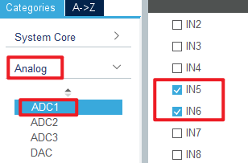
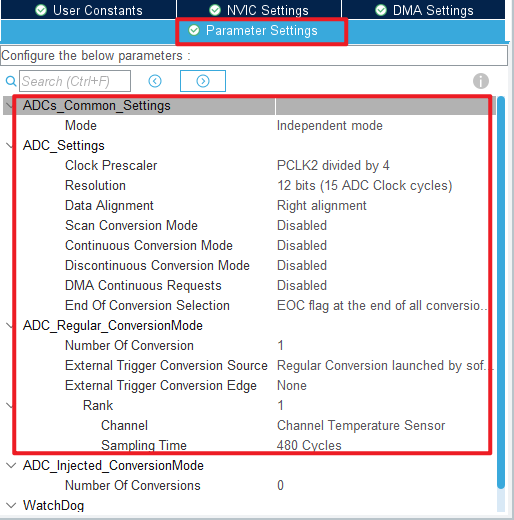
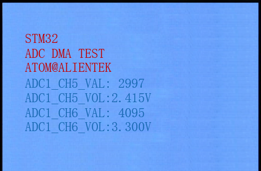

## ADC_DMA_Multi_Channel example<a name="brief"></a>

### 1 Brief
The function of this code is to collect the voltage on channel 1 and channel 5 of ADC through DMA, and display the digital amount of the voltage converted by ADC and the analog amount converted by ADC on the LCD module screen.
### 2 Hardware Hookup
The hardware resources used in this example are:
+ LED0 - PE5
+ USART1 - PA9/PA10
+ ADC1 - Channel5(PA5)
+ ADC1 - Channel6(PA6)
+ ALIENTEK  2.8/3.5/4.3/7 inch TFTLCD module

The ADC used in this example is an on-chip resource of STM32F407, so there is no corresponding connection schematic.

### 3 STM32CubeIDE Configuration

We copy the previous chapter project and name both the project and the.ioc file **17_3_adc_dma_multi_channel**.Next we start the ADC configuration by double-clicking the **17_3_adc_dma_multi_channel.ioc** file.

Since this example uses one more ADC channel than the example in the previous chapter, the ADC channel needs to be reconfigured.
Click **Analog > ADC1** to set. 



Next are the ADC1 parameters, as shown in the following screenshot.



Click **File > Save**, and you will be asked to generate code.Click **Yes**.

The code for the ADC and DMA is the same as in the previous chapter, but we have already covered them and will not repeat them here.

##### code
###### main.c
Here's the code in the main function.
```c#
/* USER CODE BEGIN PV */
#define ADC_NCH_DMA_BUF_SIZE    (50 * 2)
uint16_t g_adc_nch_dma_buf[ADC_NCH_DMA_BUF_SIZE];
extern uint8_t g_adc_nch_dma_sta;

extern DMA_HandleTypeDef hdma_adc1;
/* USER CODE END PV */
int main(void)
{
  /* USER CODE BEGIN 1 */
	uint16_t adc_result[2];
	uint16_t voltage;
	uint16_t index;
	uint32_t result_sum;
	uint8_t ch_index;
  /* USER CODE END 1 */

  /* MCU Configuration--------------------------------------------------------*/

  /* Reset of all peripherals, Initializes the Flash interface and the Systick. */
  HAL_Init();

  /* USER CODE BEGIN Init */

  /* USER CODE END Init */

  /* Configure the system clock */
  SystemClock_Config();

  /* USER CODE BEGIN SysInit */

  /* USER CODE END SysInit */

  /* Initialize all configured peripherals */
  MX_GPIO_Init();
  MX_DMA_Init();
  MX_USART1_UART_Init();
  MX_FSMC_Init();
  MX_ADC1_Init((uint32_t)g_adc_nch_dma_buf);
  /* USER CODE BEGIN 2 */
  lcd_init();                                         /* Initialize LCD */
  stm32f407vg_show_mesg();

  lcd_show_string(30, 50, 200, 16, 16, "STM32", RED);
  lcd_show_string(30, 70, 200, 16, 16, "ADC DMA TEST", RED);
  lcd_show_string(30, 90, 200, 16, 16, "ATOM@ALIENTEK", RED);

  lcd_show_string(30, 110, 200, 16, 16, "ADC1_CH5_VAL:0", BLUE);
  lcd_show_string(30, 130, 200, 16, 16, "ADC1_CH5_VOL:0.000V", BLUE);

  lcd_show_string(30, 150, 200, 16, 16, "ADC1_CH6_VAL:0", BLUE);
  lcd_show_string(30, 170, 200, 16, 16, "ADC1_CH6_VOL:0.000V", BLUE);

  adc_nch_dma_enable(ADC_NCH_DMA_BUF_SIZE);   /* Start the ADC DMA acquisition */

  /* Infinite loop */
  /* USER CODE BEGIN WHILE */
  while (1)
  {
    if (g_adc_nch_dma_sta == 1)
    {
        g_adc_nch_dma_sta = 0;

        for (ch_index=0; ch_index < 2; ch_index++)
        {
            /* Average filtering of multiple ADC data read by DMA */
            for (result_sum = 0, index=0; index<(ADC_NCH_DMA_BUF_SIZE / 2); index++)
            {
                result_sum += g_adc_nch_dma_buf[(2 * index) + ch_index];
            }
            adc_result[ch_index] = result_sum / (ADC_NCH_DMA_BUF_SIZE / 2);
        }

        voltage = (adc_result[0] * 3300) / 4095;
        lcd_show_xnum(134, 110, adc_result[0], 5, 16, 0, BLUE);
        lcd_show_xnum(134, 130, voltage / 1000, 1, 16, 0, BLUE);
        lcd_show_xnum(150, 130, voltage % 1000, 3, 16, 0x80, BLUE);

        voltage = (adc_result[1] * 3300) / 4095;
        lcd_show_xnum(134, 150, adc_result[1], 5, 16, 0, BLUE);
        lcd_show_xnum(134, 170, voltage / 1000, 1, 16, 0, BLUE);
        lcd_show_xnum(150, 170, voltage % 1000, 3, 16, 0x80, BLUE);

        adc_nch_dma_enable(ADC_NCH_DMA_BUF_SIZE);
    }
    LED0_TOGGLE();             /* flashing LED0 indicates that the system is running */
    HAL_Delay(100);            /* delay 500ms */
    /* USER CODE END WHILE */

    /* USER CODE BEGIN 3 */
  }
  /* USER CODE END 3 */
}
```
The code in this section is very similar to that in the previous chapter.The data for DMA transfers are stored in the **g_adc_dma_buf** array-two channels are used in this case, so a larger DMA transfer destination memory is required. Each channel uses 50 uint16_t of space for the ADC data. To reduce error, we take the average of the data in the array.


### 4 Running
#### 4.1 Compile & Download
After the compilation is complete, connect the DAP and the Mini Board, and then connect to the computer together to download the program to the Mini Board.
#### 4.2 Phenomenon
Press the **RESET** button to begin running the program on your Mini Board, observe the LED0 flashing on the Mini Board, open the serial port and the host computer ATK-XCOM can see the prompt information of the example, indicating that the code download is successful. When the dupont line is used to connect the **PA5** and **PA6** pins with different voltage values, the digital and analog voltage of the LCD screen will also change. **It should be noted that the input voltage cannot exceed the 3.3V threshold of the Mini Board**, otherwise it may damage the Mini Board. The phenomenon is illustrated in the following figure:



[jump to title](#brief)