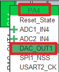
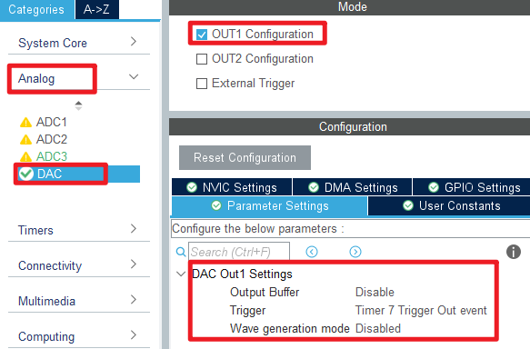
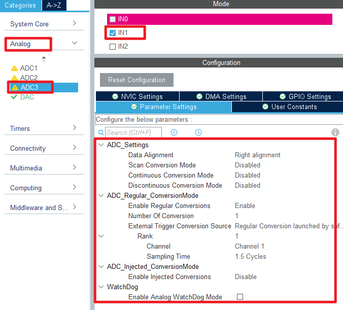
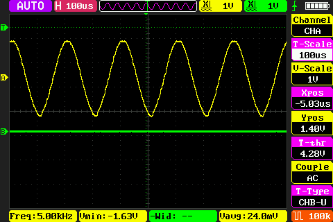

## DAC_Sine_Wave example<a name="brief"></a>

### 1 Brief
The function of this code is to press the KEY0 button and the PA4 pin outputs the sine wave 1. Press the WKUP button, pin PA4 outputs sine wave 2. The serial port displays the DAC conversion value, the voltage value, and the voltage value of the ADC.
### 2 Hardware Hookup
The hardware resources used in this example are:
+ LED0 - PE5
+ USART1 - PA9/PA10
+ ADC3 - Channel1(PA1)
+ DAC1 - Channel1(PA4)
+ TIM7
+ ALIENTEK DS100 oscilloscope
+ ALIENTEK  2.8/3.5/4.3/7 inch TFTLCD module

The DAC used in this example is an on-chip resource of STM32F407, so there is no corresponding connection schematic.

### 3 STM32CubeIDE Configuration


We copy the **11_tftlcd** project and name both the project and the.ioc file **19_3_dac_sine_wave**.Next we start the DAC configuration by double-clicking the **19_3_dac_sine_wave.ioc** file.

In **Pinout&Configuration**, click **PA4** pin to set mode.



Then open **Analog->DAC1** to configure.



The configuration in **Analog->ADC3** is as follows:



Then configure TIM7 as shown.


Click **File > Save**, and you will be asked to generate code.Click **Yes**.

Among them, ADC and TIM files have been introduced in the previous chapters, and the added content is basically the same. You can open the source code to check it by yourself. The logic code added for this example is described below.

##### code
###### dac.c
```c#
 void dac_creat_sin_buf(uint16_t maxval, uint16_t samples)
{
    uint8_t i;
    float inc = (2 * 3.1415962) / samples;      /* Increment of computation (DAC SIN BUF points per cycle) */
    float outdata = 0;

    for (i = 0; i < samples; i++)
    {
        outdata = maxval * (1 + sin(inc * i));  /* The value of each point with a period of dots points is calculated,
                                                 * enlarged by a factor of maxval, and offset to the positive number region. */
        if (outdata > 4095)
            outdata = 4095;                     /* Upper limit limit */
        g_dac_sin_buf[i] = outdata;
    }
}

/**
 * @brief   DAC DMA enable waveform output
 * @param   ndtr : Amount of data transferred in a single DMA channel
 * @param   arr  : automatic reload value for TIM7
 * @param   psc  : the frequency division coefficient of TIM7
 * @retval  None
 */
void dac_dma_wave_enable(uint16_t ndtr, uint16_t arr, uint16_t psc)
{
   __HAL_TIM_SET_PRESCALER(&htim7, psc);
   __HAL_TIM_SET_AUTORELOAD(&htim7, arr);
   HAL_TIM_Base_Start(&htim7);              /* Start timer 7 */

   HAL_DAC_Stop_DMA(&hdac, DAC_CHANNEL_1);  /* Stop the previous transmission first */
   HAL_DAC_Start_DMA(&hdac, DAC_CHANNEL_1, (uint32_t *)g_dac_sin_buf, ndtr, DAC_ALIGN_12B_R);
}
```
The function ``dac_creat_sin_buf`` is used to generate the sine wave sequence, which is stored in the **g_dac_sin_buf** array for DAC conversion.
The function ``dac_dma_wave_enable`` is used to configure the TIM7 overflow frequency, so the TIM7 overflow frequency determines the DAC output sine wave frequency and also enables DAC DMA transfer.

##### main.c
Here's the main function.
```c#
int main(void)
{
  /* USER CODE BEGIN 1 */
  uint16_t adcx;
  float temp;
  uint8_t t = 0;
  uint8_t key;
  /* USER CODE END 1 */

  /* MCU Configuration--------------------------------------------------------*/

  /* Reset of all peripherals, Initializes the Flash interface and the Systick. */
  HAL_Init();

  /* USER CODE BEGIN Init */

  /* USER CODE END Init */

  /* Configure the system clock */
  SystemClock_Config();

  /* USER CODE BEGIN SysInit */

  /* USER CODE END SysInit */

  /* Initialize all configured peripherals */
  MX_GPIO_Init();
  MX_DMA_Init();
  MX_USART1_UART_Init();
  MX_FSMC_Init();
  MX_DAC_Init();
  MX_ADC3_Init();
  MX_TIM7_Init();
  /* USER CODE BEGIN 2 */
  lcd_init();                                         /* Initialize LCD */
  stm32f407vg_show_mesg();
  dac_creat_sin_buf(2048, 100);
  dac_dma_wave_enable(100, 10 - 1, 84 - 1);
  HAL_DMA_Start(&hdma_dac_ch1, (uint32_t)&DAC1->DHR12R1, (uint32_t)g_dac_sin_buf, 0);

  lcd_show_string(30, 50, 200, 16, 16, "STM32", RED);
  lcd_show_string(30, 70, 200, 16, 16, "DAC DMA Sine Wave TEST", RED);
  lcd_show_string(30, 90, 200, 16, 16, "ATOM@ALIENTEK", RED);

  lcd_show_string(30, 110, 200, 16, 16, "WK_UP:Wave1 KEY0:Wave2", RED);

  lcd_show_string(30, 150, 200, 16, 16, "DAC VAL:", BLUE);
  lcd_show_string(30, 170, 200, 16, 16, "DAC VOL:0.000V", BLUE);
  lcd_show_string(30, 190, 200, 16, 16, "ADC VOL:0.000V", BLUE);
  /* USER CODE END 2 */

  /* Infinite loop */
  /* USER CODE BEGIN WHILE */
  while (1)
  {
    t++;
    key = key_scan(0);                               /* Scan key */

    if (key == WKUP_PRES)                            /* High sampling rate, about 5Khz waveform */
    {
        lcd_show_string(30, 130, 200, 16, 16, "DAC Wave1", RED);
        dac_creat_sin_buf(2048, 100);                /* Generate a sequence of sine wave functions */
        dac_dma_wave_enable(100, 10 - 1, 84 - 1);    /* 5Khz trigger frequency, 100 points to obtain a sine wave of up to 5KHz. */
    }
    else if (key == KEY0_PRES)                       /* Low sampling rate, about 1Khz waveform */
    {
        lcd_show_string(30, 130, 200, 16, 16, "DAC Wave2", RED);
        dac_creat_sin_buf(2048, 10);                 /* Generate a sequence of sine wave functions */
        dac_dma_wave_enable(10, 10 - 1, 84 - 1);     /* With 50Khz trigger frequency and 10 points, a sine wave up to 50KHz can be obtained. */
    }

    adcx = DAC1->DHR12R1;                            /* Get the output status of DAC1_OUT1 */
    lcd_show_xnum(94, 150, adcx, 4, 16, 0, BLUE);    /* Display DAC register values */

    temp = (float)adcx * (3.3 / 4096);               /* The DAC voltage value is obtained */
    adcx = temp;
    lcd_show_xnum(94, 170, temp, 1, 16, 0, BLUE);    /* Display voltage value */

    temp -= adcx;
    temp *= 1000;
    lcd_show_xnum(110, 170, temp, 3, 16, 0X80, BLUE);

    adcx = adc3_get_result_average(10);              /* The conversion result of ADC channel 1 is obtained */
    temp = (float)adcx * (3.3 / 4096);               /* Get the ADC voltage value (adc is 12bit) */
    lcd_show_xnum(94, 190, temp, 1, 16, 0, BLUE);    /* Display the voltage value acquired by the ADC */

    temp -= adcx;
    temp *= 1000;
    lcd_show_xnum(110, 190, temp, 3, 16, 0X80, BLUE);

    LED0_TOGGLE();             /* flashing LED0 indicates that the system is running */
    HAL_Delay(10);             /* delay 10ms */
    /* USER CODE END WHILE */

    /* USER CODE BEGIN 3 */
  }
  /* USER CODE END 3 */
}
```
When this part of the code is initialized, a set of sine wave data is generated to control the DAC channel 1 to output the specified sine wave. Then, according to the scanned keys, the sine waves with different frequencies are output.


### 4 Running
#### 4.1 Compile & Download
After the compilation is complete, connect the DAP and the Mini Board, and then connect to the computer together to download the program to the Mini Board.
#### 4.2 Phenomenon
Press the **RESET** button to begin running the program on your Mini Board, observe the LED0 flashing on the Mini Board, open the serial port and the host computer ATK-XCOM can see the prompt information of the example, indicating that the code download is successful. Connect the **PA4** pin with a **ALIENTEK DS100 oscilloscope** and press the KEY0 and WKUP keys respectively. You can see two different types of sine waves, as shown in the following figure.




[jump to title](#brief)