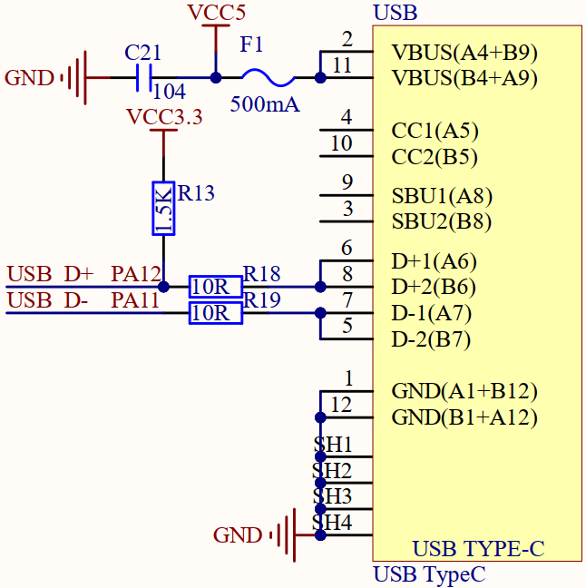
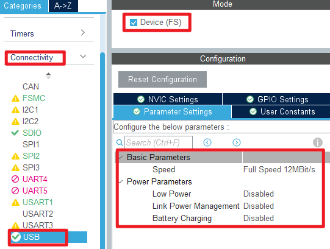
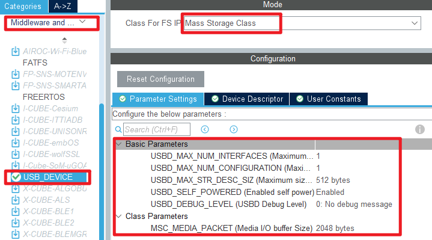
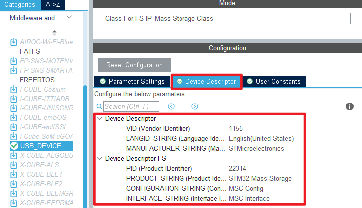
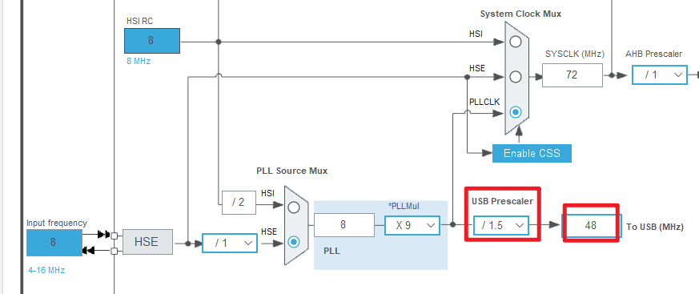
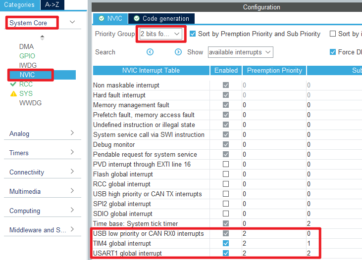
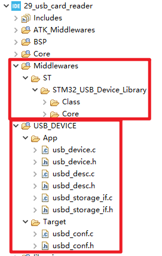
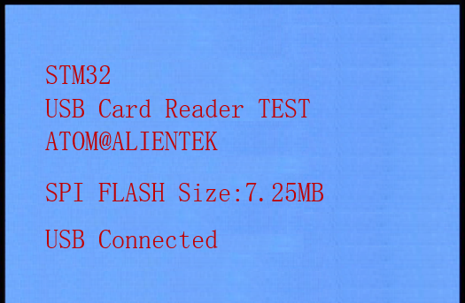

## USB card reader example<a name="brief"></a>


### 1 Brief
The function of this example is to simulate a USB card reader with STM32F103.
### 2 Hardware Hookup
The hardware resources used in this example are:
+ LED0 - PE5
+ LED1 - PE6
+ USART1 - PA9/PA10
+ KEY - KEY0(PA15)
+ Micro SD card
+ ALIENTEK  2.8/3.5/4.3/7 inch TFTLCD module

In this example, USB interface is used to connect with PC, and the connection schematic diagram of USB SLAVE interface and MCU is shown below:



### 3 STM32CubeIDE Configuration

We copy the project from **26_sd** and name both the project and the.ioc file **34_1_usb_card_reader**. Next we start the configuration by double-clicking the **34_1_usb_card_reader.ioc** file.

Click **Connectivity -> USB**, activate the USB slave device:



Then start configuring the USB middleware, click **Middleware and Software Packs -> USB_DEVICE**:



The device descriptor is left to its default Settings as shown in the figure below:



After the above configuration, it is found that there is an error in the USB clock configuration, and the clock frequency exceeds 48MHz. So we need to make the following changes.



We need to get the USB connection status and configure the interrupt priority in the USB interrupt callback function.



Click **File > Save**, and you will be asked to generate code.Click **Yes**.The generated project has two more folders, USB_DEVICE and Middlewares.




##### code

In this example, several files need to be modified in the USB_DEVICE folder: **usbd_storage_if.c**,**usbd_conf.c**, and **usbd_conf.h**.

**usbd_conf.c/.h** mainly implements USB hardware initialization and interrupt operations.
**usbd_storage_if.c** mainly realizes an identification information of mass storage device.


###### main.c
```c#
int main(void)
{
  /* USER CODE BEGIN 1 */
  uint8_t offline_cnt = 0;
  uint8_t tct = 0;
  uint8_t usb_sta;
  uint8_t device_sta;
  uint16_t id;
  /* USER CODE END 1 */

  /* MCU Configuration--------------------------------------------------------*/

  /* Reset of all peripherals, Initializes the Flash interface and the Systick. */
  HAL_Init();

  /* USER CODE BEGIN Init */

  /* USER CODE END Init */

  /* Configure the system clock */
  SystemClock_Config();

  /* USER CODE BEGIN SysInit */

  /* USER CODE END SysInit */

  /* Initialize all configured peripherals */
  MX_GPIO_Init();
  MX_USART1_UART_Init();
  MX_FSMC_Init();
  MX_TIM4_Init();
  MX_SDIO_SD_Init();
  MX_SPI2_Init();
  MX_USB_DEVICE_Init();
  /* USER CODE BEGIN 2 */
  lcd_init();                         /* Initialize LCD */
  norflash_init();                    /* Initialize NOR FLASH */
  my_mem_init(SRAMIN);                /* Initialize the internal SRAM memory pool */
  my_mem_init(SRAMCCM);               /* Initialize the CCM memory pool */
  stm32f407vg_show_mesg();

  lcd_show_string(30, 50, 200, 16, 16, "STM32", RED);
  lcd_show_string(30, 70, 200, 16, 16, "USB Card Reader TEST", RED);
  lcd_show_string(30, 90, 200, 16, 16, "ATOM@ALIENTEK", RED);

  while (g_sd_error == 1)
  {
     g_sd_error = 0;
     MX_SDIO_SD_Init();
     lcd_show_string(30, 130, 200, 16, 16, "SD Card Error!", RED);
     HAL_Delay(500);
     lcd_show_string(30, 130, 200, 16, 16, "Please Check! ", RED);
     HAL_Delay(500);
     LED1_TOGGLE();
  }

  lcd_show_string(30, 130, 200, 16, 16, "SD Card OK    ", BLUE);

  id = norflash_read_id();
  if ((id == 0) || (id == 0XFFFF))
  {
    lcd_show_string(30, 110, 200, 16, 16, "NorFlash Error!", RED);  /* Detecting NorFlash errors */
  }
  else   /* SPI FLASH normal */
  {
    lcd_show_string(30, 130, 200, 16, 16, "SPI FLASH Size:7.25MB", RED);
  }

  usbd_port_config(0);    /* The USB cable is disconnected */
  HAL_Delay(500);
  usbd_port_config(1);    /* USB connection again */
  HAL_Delay(500);

  lcd_show_string(30, 170, 200, 16, 16, "USB Connecting...", RED);    /* A connection is being established */
  HAL_Delay(1800);
  /* USER CODE END 2 */

  /* Infinite loop */
  /* USER CODE BEGIN WHILE */
  while (1)
  {
    HAL_Delay(1);

    if (usb_sta != g_usb_state_reg)   /* The state changes */
    {
      lcd_fill(30, 190, 240, 210 + 16, WHITE); /* clear display */

      if (g_usb_state_reg & 0x01)     /* Writing */
      {
        LED1(0);
        lcd_show_string(30, 190, 200, 16, 16, "USB Writing...", RED); /* USB is writing data */
      }

      if (g_usb_state_reg & 0x02)   /* Reading */
      {
        LED1(0);
        lcd_show_string(30, 190, 200, 16, 16, "USB Reading...", RED); /* USB is reading data */
      }

      if (g_usb_state_reg & 0x04)
      {
        lcd_show_string(30, 210, 200, 16, 16, "USB Write Err ", RED); /* Prompt write error */
      }
      else
      {
        lcd_fill(30, 210, 240, 230 + 16, WHITE); /* clear display */
      }

      if (g_usb_state_reg & 0x08)
      {
        lcd_show_string(30, 230, 200, 16, 16, "USB Read  Err ", RED); /* Prompt readout error */
      }
      else
      {
        lcd_fill(30, 230, 240, 250 + 16, WHITE); /* clear display */
      }

      usb_sta = g_usb_state_reg; /* Record the final state */
    }

    if (device_sta != g_device_state)
    {
      if (g_device_state == 1)
      {
        lcd_show_string(30, 170, 200, 16, 16, "USB Connected    ", RED);    /* A USB connection has been established */
      }
      else
      {
        lcd_show_string(30, 170, 200, 16, 16, "USB DisConnected ", RED);    /* USB is unplugged */
      }

      device_sta = g_device_state;
    }

    tct++;

    if (tct == 200)
    {
      tct = 0;
      LED1(1);        /* turn off LED1 */
      LED0_TOGGLE();  /* LED0 blink */

      if (g_usb_state_reg & 0x10)
      {
        offline_cnt = 0;    /* When USB is connected, clear the offline counter */
        g_device_state = 1;
      }
      else    /* No polling */
      {
        offline_cnt++;

        if (offline_cnt > 100)
        {
          g_device_state = 0;/* If no online marker is received within 20s, the USB has been unplugged */
        }
      }

      g_usb_state_reg = 0;
    }
    /* USER CODE END WHILE */

    /* USER CODE BEGIN 3 */
  }
  /* USER CODE END 3 */
}
```
After calling the **MX_USB_DEVICE_Init** function, the USB read/write status and connection status are continuously obtained and displayed on the LCD.

### 4 Running
#### 4.1 Compile & Download
After the compilation is complete, connect the DAP and the Mini Board, and then connect to the computer together to download the program to the Mini Board.
#### 4.2 Phenomenon
Press the **RESET** button to begin running the program on your Mini Board, observe the LED0 flashing on the Mini Board, open the serial port and the host computer ATK-XCOM can see the prompt information of the example, indicating that the code download is successful. 

Insert the SD card into the SD card holder on the Mini Board, and you can see the capacity information of the SD card and the connection status of USB on the LCD.




[jump to title](#brief)
